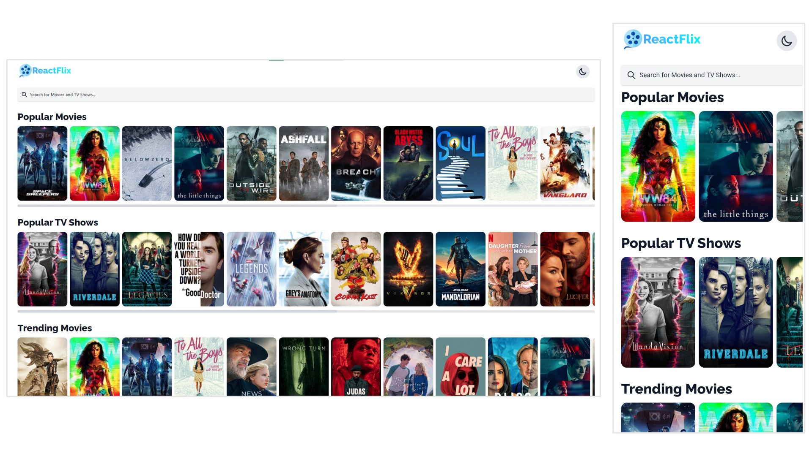
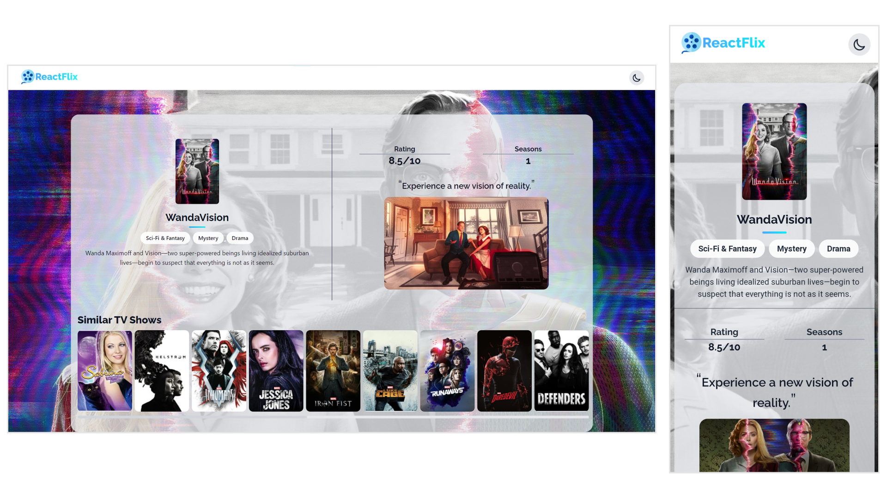
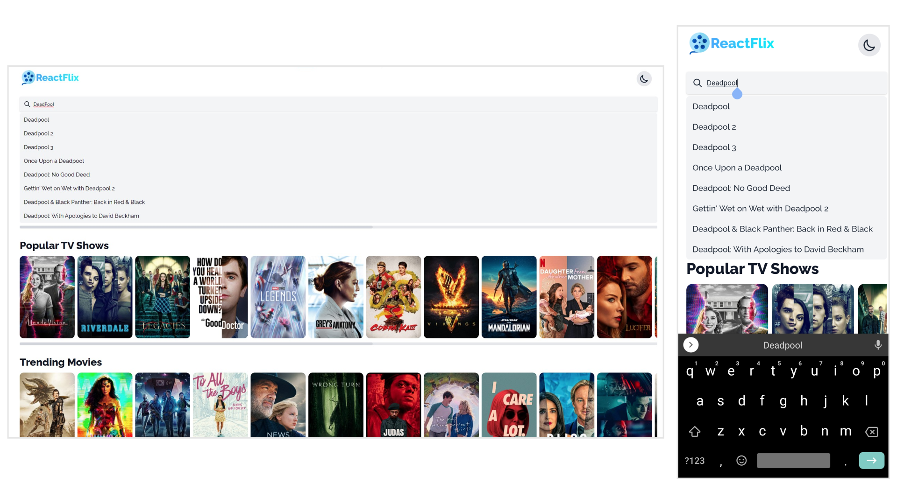
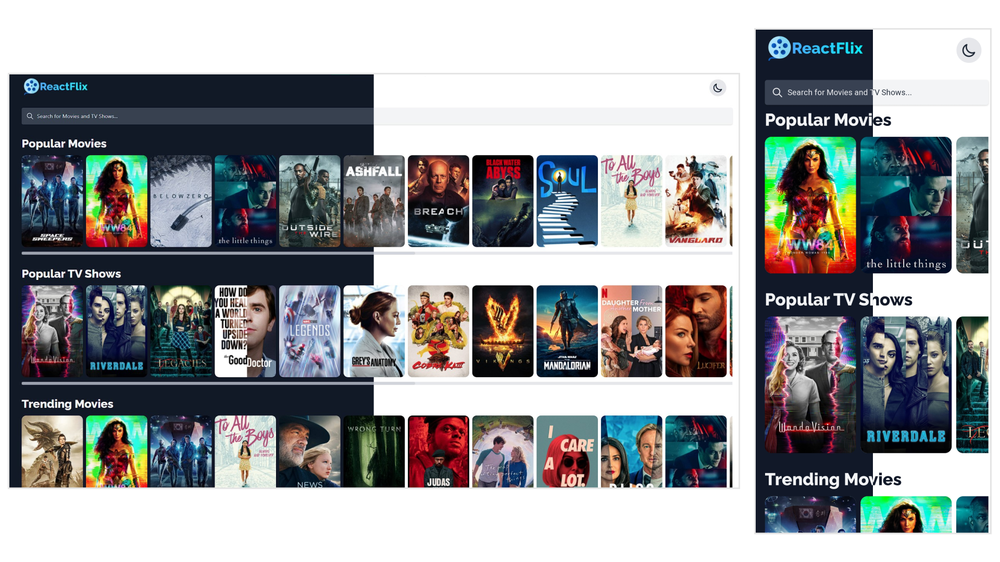
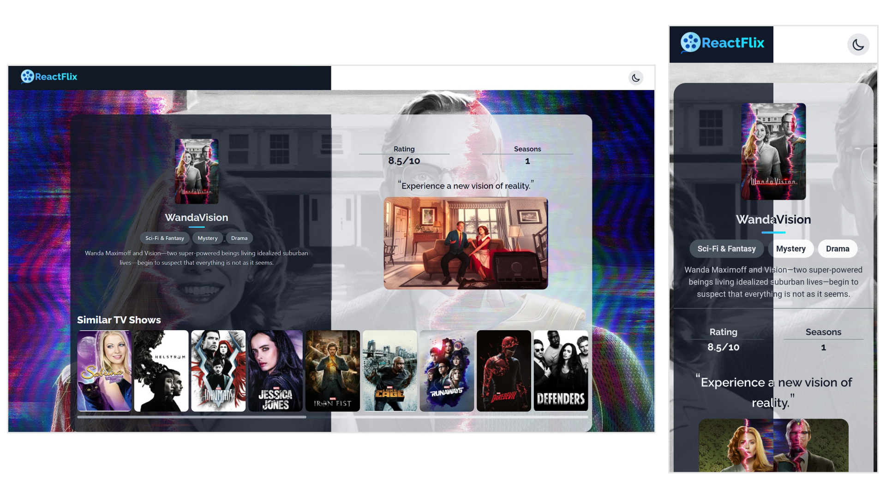
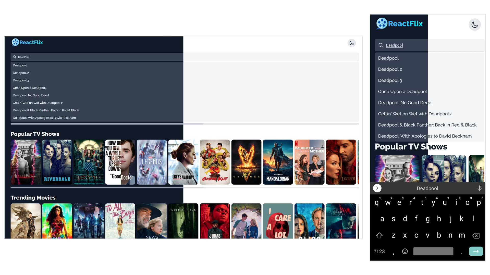

# ReactFlix
 &nbsp;&nbsp; 

A movie library built using NextJS (a ReactJS Framework), TailwindCSS and TypeScript. The website is powered by the TMDB API. 

# Contents

- [Home Page](#home-page)
- [Details Page](#details-page)
- [Search](#search)
- [Dark Mode](#dark-mode)

# Technologies Used

| Name        | Description |
| ----------- | ---------------- |
| Next.js     | An open-source React front-end development web framework that enables functionality such as server-side rendering and generating static websites for React based web applications. |
| TailwindCSS | A utility-first CSS framework packed with classes that can be composed to build any design, directly in your markup. |
| TypeScript  | It is a strict syntactical superset of JavaScript and adds optional static typing to the language. |
| TMDB API    | The TMDb API is a resource for developers to integrate movie, TV show and cast data along with posters or movie fan art.|

# Home Page

ReactFlix's home page displays multiple lists of movies and tv shows such as the popular movies, popular tv shows, etc. A user can click on a specific movie or tv show and view more details about it. The home page also contains the [search bar](#search) which lets the user search for a movie or tv show.  

# Details Page

The details page displays more information about a selected movie or tv show. This page contains information such as the genres, description, rating, number of seasons (for a tv show) or release status (for a movie). The page also displays similar movies or tv shows as recommendations for the user.

# Search

The search bar is present on the home page. The user can start typing and they will be shown results based on their input. The debounce method is used to send a query if the user stops typing for a while (200ms) and the data returned from the query is displayed to the user as a list.

# Dark Mode

ReactFlix uses tailwind's in-built dark mode support to provide a dark mode experience for the user. When the user clicks on the theme toggle button on the top-right part of the page, the theme for the entire application is changed with a smooth transition. You can view more screenshots of ReactFlix's dark mode below.

